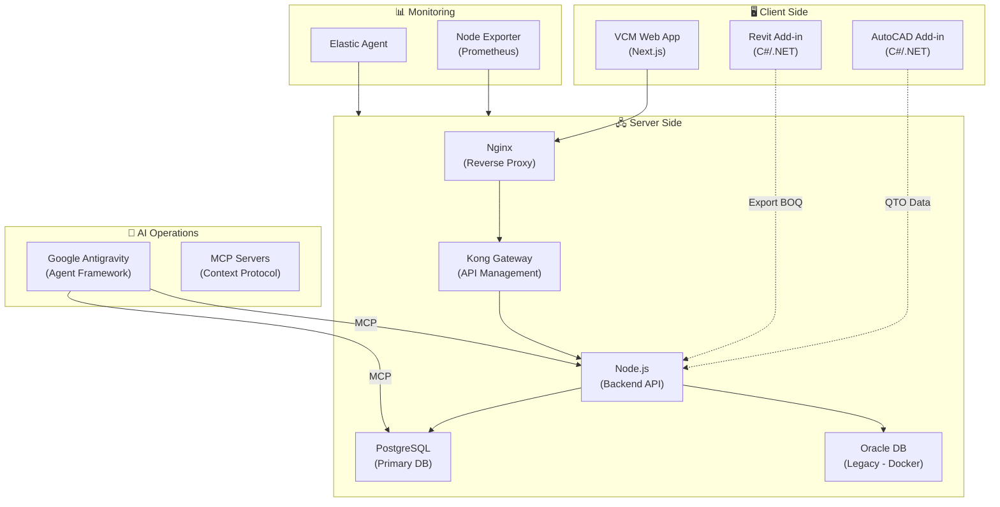

# 🏗️ Kiến trúc hệ thống – Architecture Overview

> **SSOT** (Single Source of Truth) cho kiến trúc tổng thể.
> Cập nhật lần cuối: 2026-03-20

---

## Toàn cảnh hệ sinh thái dự án

---

## Thành phần chính

### 1. VCM Management Web App
- **Stack**: Next.js + React
- **Chức năng**: Quản lý dự toán, hợp đồng, hóa đơn, dashboard
- **Deploy**: Ubuntu Server 24.04 (hostname: `vcm-app-db-node-02`)
- **i18n**: Hỗ trợ Tiếng Việt (`vi.json`) + English (`en.json`)

### 2. Revit Add-in (HVC Tools)
- **Stack**: C# / .NET Framework
- **Chức năng**: Bóc tách khối lượng (QTO), export BOQ
- **Brand**: "HVC Tools – Made by Cavaho"
- **Distribution**: Installer (.exe)

### 3. AutoCAD Add-in
- **Stack**: C# / .NET
- **Chức năng**: QTO từ bản vẽ CAD

### 4. Server Infrastructure
| Component | Detail |
|-----------|--------|
| OS | Ubuntu Server 24.04 |
| CPU/RAM | 24 vCPUs / 48GB |
| Storage | 1TB |
| IP | 10.201.42.65 (static) |
| Hostname | vcm-app-db-node-02 |
| User | aio_myanmar |

### 5. Database Strategy
- **PostgreSQL**: Primary database cho tất cả module mới
- **Oracle DB**: Legacy database, chạy qua Docker container
- **Migration path**: Dần chuyển Oracle → PostgreSQL

---

## Nguyên tắc kiến trúc

1. **API-First**: Mọi giao tiếp qua API chuẩn REST
2. **SSOT**: Không duplicate data giữa các hệ thống
3. **MCP Connectivity**: Agent truy cập live data, không snapshot
4. **Gradual Migration**: Oracle → PostgreSQL từng module
