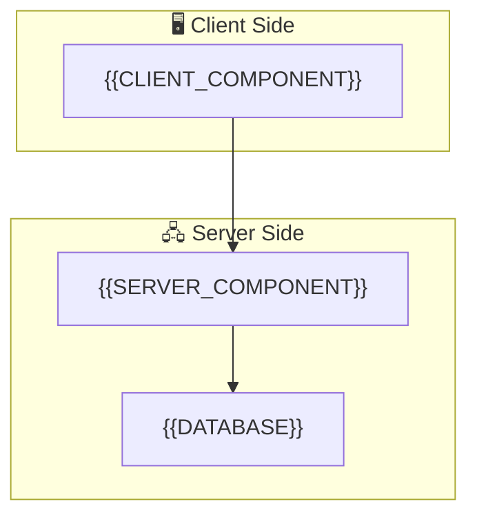

# 🏗️ Kiến trúc hệ thống – {{PROJECT_NAME}}

> **SSOT** (Single Source of Truth) cho kiến trúc tổng thể.
> Cập nhật lần cuối: {{DATE}}

---

## Tổng quan

**Dự án**: {{PROJECT_NAME}}
**Mô tả**: {{PROJECT_DESCRIPTION}}
**Tech Stack**: {{TECH_STACK}}
**Loại ứng dụng**: {{APP_TYPE}}

---

## Sơ đồ kiến trúc

> ⚠️ Cập nhật sơ đồ này khi kiến trúc thay đổi.

---

## Thành phần chính

### 1. {{COMPONENT_1_NAME}}
- **Stack**: {{COMPONENT_1_STACK}}
- **Chức năng**: {{COMPONENT_1_DESCRIPTION}}
- **Deploy**: {{COMPONENT_1_DEPLOY}}

### 2. {{COMPONENT_2_NAME}}
- **Stack**: {{COMPONENT_2_STACK}}
- **Chức năng**: {{COMPONENT_2_DESCRIPTION}}

> Thêm các component khác khi dự án mở rộng.

---

## Infrastructure

| Component | Detail |
|-----------|--------|
| OS | {{OS}} |
| Deploy target | {{DEPLOY_TARGET}} |
| Database | {{DATABASE}} |
| Monitoring | {{MONITORING}} |

---

## Nguyên tắc kiến trúc

1. **SSOT**: Không duplicate data giữa các hệ thống
2. **{{PRINCIPLE_1}}**: {{PRINCIPLE_1_DESCRIPTION}}
3. **{{PRINCIPLE_2}}**: {{PRINCIPLE_2_DESCRIPTION}}

---

## Dữ liệu nhạy cảm

{{SENSITIVE_DATA_POLICY}}
